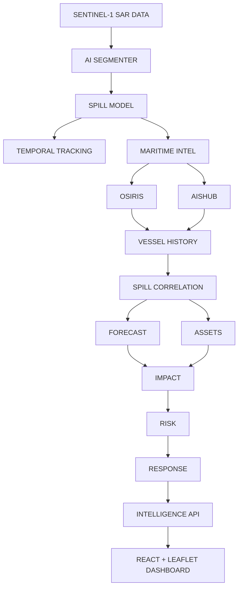

# Oil Spill Intelligence System

AI-powered satellite SAR oil-spill intelligence, forecasting, impact assessment, and decision-support platform.

This is **not** a simple image classifier. The pipeline runs from SAR preprocessing through segmentation, geospatial reconstruction, temporal tracking, trajectory forecasting, asset impact analysis, explainable risk scoring, and a grounded AI assistant.

## Current Status

| Component | Status |
|-----------|--------|
| FastAPI backend (15+ endpoint groups) | **Complete** |
| React + Leaflet GIS dashboard | **Complete** |
| SQLite state ledger (PostGIS-ready schema) | **Complete** |
| ML segmentation (DeepLabV3+, U-Net) | **Implemented** — untrained by default |
| Geospatial pipeline (WGS84 geodesic area) | **Complete** |
| Temporal Hungarian tracker | **Complete** |
| Lagrangian Monte Carlo forecasting | **Complete** |
| Impact + 6-factor risk engine | **Complete** |
| Grounded AI assistant | **Complete** (local heuristic) |
| Automated tests (22) | **All passing** |
| Real Sentinel-1 ingestion | **Interface ready** — requires CDSE credentials |
| Trained model checkpoint | **Not included** — run training script |
| Krestenitis dataset | **Not included** — download separately |

## Quick Start

### 1. Install dependencies

```bash
cd "c:\projects\OIL SPILL"
python -m pip install -r requirements.txt
# PyTorch CPU (if not already installed):
python -m pip install torch torchvision --index-url https://download.pytorch.org/whl/cpu
```

### 2. Configure environment

```bash
copy .env.example .env
```

### 3. Seed demo data and start backend

```bash
python scripts/seed_database.py
python -m uvicorn backend.app.main:app --host 127.0.0.1 --port 8000 --reload
```

API docs: http://127.0.0.1:8000/docs

### 4. Start frontend

```bash
cd frontend
npm install
npm run dev
```

Dashboard: http://localhost:5173

Click **Load Case Study** in the navbar to run the Ennore Port 2017 **DEMO** multi-pass scenario.

## Run Tests

```bash
python -m pytest -v
```

## System Architecture



## Train Segmentation Model

Download the [Krestenitis benchmark](https://doi.org/10.3390/rs11151762) (Zenodo) into `data/segmentation/krestenitis/` with `images/` and `masks/` subfolders, then:

```bash
python scripts/train_segmentation.py --data-dir data/segmentation/krestenitis --epochs 10
```

Checkpoints save to `./ml/experiments/checkpoints/` (configurable via `MODEL_CHECKPOINT_DIR`).

## Real Sentinel-1 Data

1. Register at [Copernicus Data Space Ecosystem](https://dataspace.copernicus.eu)
2. Set `CDSE_CLIENT_ID` and `CDSE_CLIENT_SECRET` in `.env`
3. Search: `GET /api/v1/scenes/search/cdse?min_lon=...&min_lat=...&max_lon=...&max_lat=...&start=...&end=...`
4. Ingest local GeoTIFF: use `SceneIngestionService.ingest_from_local_geotiff()`

## Environment Variables

See `.env.example` for full list. Key variables:

| Variable | Purpose |
|----------|---------|
| `DATABASE_URL` | SQLite (default) or PostgreSQL/PostGIS |
| `CDSE_CLIENT_ID/SECRET` | Sentinel-1 catalogue & download |
| `CMEMS_USERNAME/PASSWORD` | Ocean currents & waves |
| `CDS_API_KEY` | ERA5 wind reanalysis |
| `MODEL_CHECKPOINT_DIR` | Trained segmentation weights |
| `DEVICE` | `cpu` or `cuda` |

## Documentation

- [ARCHITECTURE.md](docs/ARCHITECTURE.md)
- [API.md](docs/API.md)
- [DATASETS.md](docs/DATASETS.md)
- [ML_PIPELINE.md](docs/ML_PIPELINE.md)
- [ENVIRONMENT_SETUP.md](docs/ENVIRONMENT_SETUP.md)
- [MODEL_EVALUATION.md](docs/MODEL_EVALUATION.md)
- [DEVELOPMENT.md](docs/DEVELOPMENT.md)

## Data Honesty

- Demo/synthetic SAR rasters are labeled `DEMO_DATA` / `is_synthetic=true`
- Environmental adapters return `DEMO_DATA` when API credentials are absent
- No model accuracy is claimed without running evaluation on held-out data
- The assistant refuses to invent coordinates, areas, or risk scores

## Known Limitations

- Default ML weights are ImageNet-pretrained encoders only (not fine-tuned on oil spill data)
- OpenDrift/PyGNOME not integrated; custom Lagrangian ensemble used as baseline
- SQLite stores GeoJSON geometry; PostGIS geometry columns available when using PostgreSQL
- Asset layers for demo region are reference polygons, not live WDPA/GFW feeds

## License

Research/educational use. Verify dataset licenses before redistribution (see `docs/DATASETS.md`).
